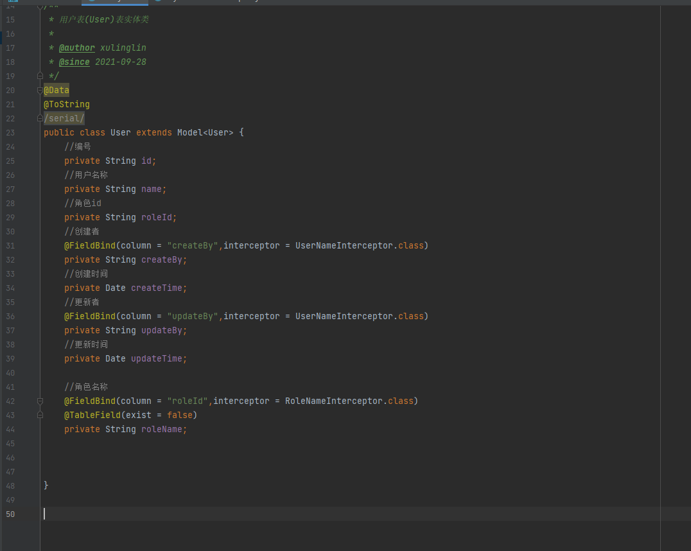
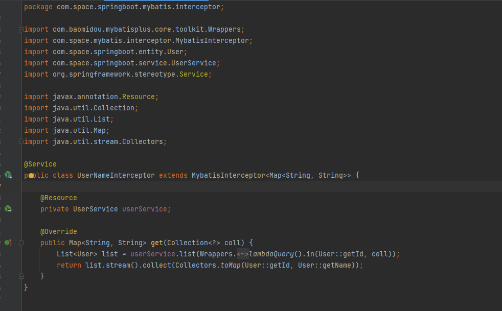
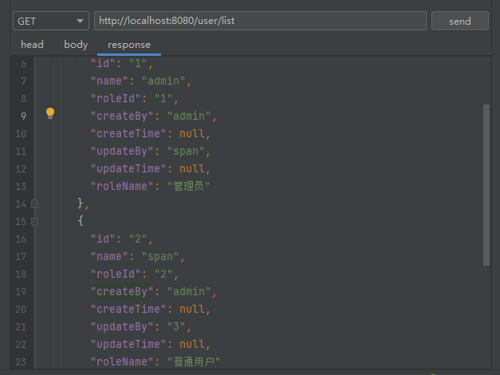
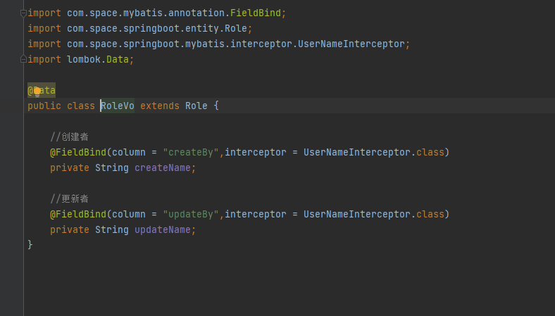
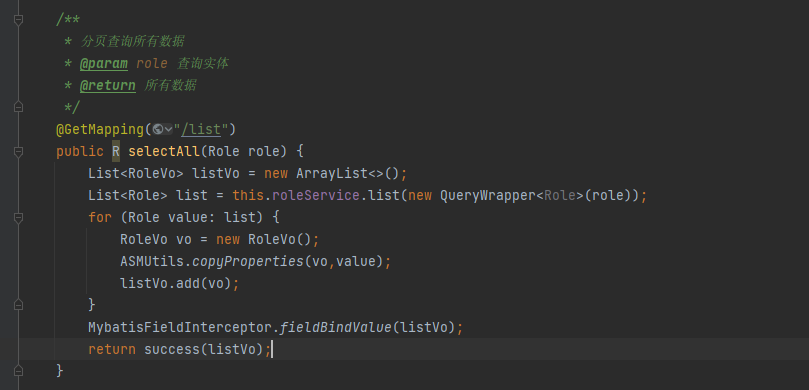

# space-mybatis 使用

## 作者

XuLingLin Java CRUD开发工作者

个人博客：https://xulinglin.com (很久没维护了,因为懒)
## 介绍

为了偷懒才开发对代码无侵入并且高效的 Mybatis 工具,主要进行字段关联表查询显示。

避免业务关联表字段进行复杂繁琐的操作,简化获取关联表字段的字段值。只需要提供 MybatisInterceptor 实现类,代码美观简化。

## 软件架构
使用Mybatis Interceptor拦截查询结果处理。

对in查询结果集,使用 Reflectasm 高效反射进行动态替换字段值。

但类属性中声明 MybatisInterceptor 有一致时间进行,动态合并查询简化调用次数提高效率

## POM 引用

```
<dependency>
  <groupId>io.github.xulinglin</groupId>
  <artifactId>space-mybatis-core</artifactId>
  <version>1.0.0.RELEASE</version>
</dependency>
```


## 使用说明

1. 在字段添加 FieldBind 注解,并且提供 MybatisInterceptor 实现类进行结果返回(目前查询结果集只支持Map进行拼接处理)
2. 调用 MybatisFieldInterceptor.fieldBindValue()进行处理

FieldBind 属性：

column 为当前查询关联条件

interceptor 为 MybatisInterceptor 返回结果集超类

## 使用步骤

### 类声明使用

1. 在查询结果集上直接声明 FieldBind 注解



2. 提供 MybatisInterceptor 实现返回关联查询结果



3. 返回查询数据中有改字段



### VO类声明使用

MybatisFieldInterceptor.fieldBindValue();对结果进行返回拼接





## 如果对你有帮助(请孩子喝一杯咖啡吧)

### 打赏在 img包 图片中(打赏时请备注,我会在打赏人添加你的信息)

## 打赏的大佬

----------

## 提交版本记录

1.2021年9月29日 1.0.0版 描述：初始化项目